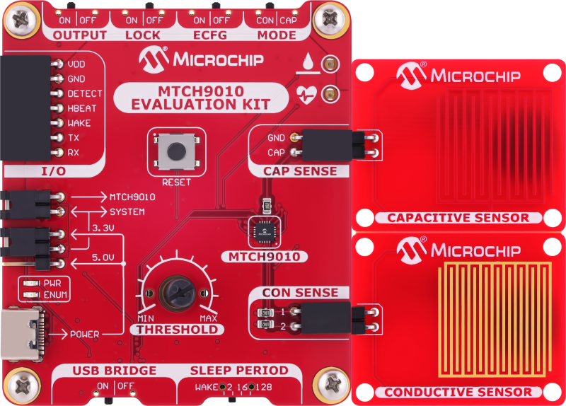

<!-- Please do not change this logo with link -->

<a target="_blank" href="https://www.microchip.com/" id="top-of-page">
   <picture>
      <source media="(prefers-color-scheme: light)" srcset="images/microchip.png" width="350">
      
   </picture>
</a>

## MTCH9010 Enhanced Configuration Using PowerShell®-Compatible Scripts

This repository contains two PowerShell®-compatible scripts for configuring the MTCH9010 through the Enhanced Configuration mode via a serial communication:
- `send_param_basic.ps1`: Basic Configuration Script 
- `send_param_enh.ps1`: Enhanced Configuration Script

## Prerequisites
- PowerShell 5.1 or newer

## Hardware Used
- [MTCH9010 Evaluation Kit](https://www.microchip.com/en-us/development-tool/EV24U22A?utm_source=GitHub&utm_medium=TextLink&utm_campaign=MCU8_mtch9010&utm_content=mtch9010-configuration-scripts-github&utm_bu=MCU08)
  

 ## Concept
 Two PowerShell®-compatible scripts for configuring the MTCH9010 are provided in this repository:
 - `send_param_basic.ps1` - this script transmits a predefined configuration to the MTCH9010 
 - `send_param_enh.ps1` - this script allows the user to transmit the desired configuration parameters
 ## Usage
Open a PowerShell terminal. From the command prompt, go to the directory where the scripts are
located. Run one of the following commands, depending on which script you are using:

 `.\send_param_basic.ps1` or  `.\send_param_enh.ps1`
 ## Configuration
 Before running the scripts, the device must be configured in Enhanced Configuration mode through the corresponding slide switch. The following configuration must be made on the MTCH9010:
- <b> ECFG </b> configured to <b> ON </b>
- <b> LOCK </b> configured to <b> OFF </b>

  

To ensure proper communication with the hardware, verify the COM port assigned to the device before running the script, as incorrect port settings can lead to connection failures. The specific COM port for the MTCH9010 Evaluation Kit can be identified by checking the Ports section in Windows Device Manager. 

The COM port used in these examples is COM37. Additionaly, the coresponding serial port must be configured as it is shown below.

`$port = New-Object System.IO.Ports.SerialPort COM37, 38400, None, 8, 1`
 - 38400: Baud rate of 38400 bits/second
 - None: No parity bit
 - 8:  Eight data bits
 - 1: One stop bit

## Scripts Functionality
`send_param_basic.ps1` transmits a predefined configuration to the MTCH9010. The following
parameters are set in this example:
- `Operation Mode`: Conductive (option `1`)
- `Sleep period`: Four seconds (option `3`)
- `Extended output mode`: Serial data enabled (option `1`)
- `Extended output format`: Standard measurement and delta (option `2`)
- Confirm the `reference value` provided (option `0`)
- Provide the `threshold value`: `800`

`send_param_enh.ps1` allows the user to enter the desired parameters. A reset is needed to start configuring the device. After the configuration is done, the script displays a message, followed by the measurements made by MTCH9010. The configured parameters can be saved in the Nonvolatile Memory (NVM) and restored at every start-up. To enable this functionality, configure the MTCH9010 as follows : 

- <b> LOCK </b> configured to <b> ON </b>
- <b> ECFG </b> configured to <b> OFF </b> 

The following table describes the available options when it comes to configuring application
parameters through the Enhanced Configuration mode:

|   Parameter                                | Value  |  Configuration                                      |
|:------------------------------------------:|:-----: |:-------------------------------------------------:  |
| Operation Mode                             |   0    | Capacitive                                          |
|                                            |   1    | Conductive                                          |
| Sleep Time                                 |   0    | Wake-up on request                                  |
|                                            |   1    | 1 second                                            |
|                                            |   2    | 2 seconds                                           |
|                                            |   3    | 4 seconds                                           |
|                                            |   4    | 8 seconds                                           |
|                                            |   5    | 16 seconds                                          |
|                                            |   6    | 32 seconds                                          |
|                                            |   7    | 64 seconds                                          |
|                                            |   8    | 128 seconds                                         |
|                                            |   9    | 256 seconds                                         |
|  Extended Output Moode                     |   0    | Disabled                                            |
|                                            |   1    | Enabled                                             |
|  Extended Output Format                    |   0    | Delta measurement                                   |
|                                            |   1    | Standard measurement                                |
|                                            |   2    | Both standard and delta measurements                |
|                                            |   3    | MPLAB Data Visualizer Data Stream protocol format   |
|  Capacitive/Conductive Reference Value     |   0    | Set the standard measurement as Reference Value     |
|                                            |   1    | Repeat the capacitive/conductive measurement        |
|                                            |   2    | Set custom Reference Value                          |
|  Capacitive/Conductive Detection Threshold |   0    | Set custom Detection Threshold                      |

Once the System Lock is enabled, the saved configuration will be used at power-up. The user can view the values acquired with the new configuration after applying a reset. The `send_param_enh.ps1` script will continue running until any key is pressed.

<b>Note</b>: A reset is required before sending the parameters to the MTCH9010 in both scenarios.

## Demo
The next demonstation GIF presents a showcase of how to configure the MTCH9010 using the `send_param_enh.ps1` script.
  

## Summary
These PowerShell®-compatible scripts are used for configuring the MTCH9010 through the Enhanced Configuration mode via a serial communication.

## Menu
- [Back to Top](#mtch9010-enhanced-configuration-using-powershell®-compatible-scripts)
- [Back to Prerequisites](#prerequisites)
- [Back to Hardware Used](#hardware-used)
- [Back to Concept](#concept)
- [Back to Usage](#usage)
- [Back to Concept](#concept)
- [Back to Configuration](#configuration)
- [Back to Scripts Functionality](#scripts-functionality)
- [Back to Demo](#demo)
- [Back to Summary](#summary)